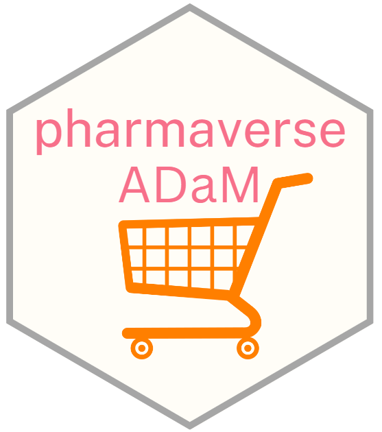

<!-- Please do not edit the README.md file as it is auto-generated after PR merges. Only edit the README.Rmd file -->
<!-- The purpose of this is to enable dynamic links using dyn_link function above to access devel/main admiral homepage respectively -->
<!-- To test this in your feature branch use code: rmarkdown::render("README.Rmd", output_format ="md_document") -->

# pharmaverseadam 

<!-- badges: start -->

[](https://pharmaverse.org)
[](https://CRAN.R-project.org/package=pharmaverseadam)

<!-- badges: end -->

Test data (ADaM) for the pharmaverse family of packages

# Purpose

To provide a one-stop-shop for ADaM test data in the pharmaverse family of packages.

# Package Contents

The ADaM contents of this package is populated by an action that executes the `{admiral}`, `{admiralonco}`, `{admiralophtha}`, `{admiralvaccine}` and `{admiralpeds}` templates and saves the resulting datasets here. This action can be triggered manually by the package maintainers in two scenarios:

-   Regularly, upon new releases of `{admiral}`, `{admiralonco}`, `{admiralophtha}` and `{admiralvaccine}`;
-   Ad-hoc, whenever templates in the above packages have been updated but releases are far away in the calendar. In this case, the ADaM datasets are created using the development version of the templates.

# Installation

The package is available from CRAN and can be installed by running `install.packages("pharmaverseadam")`. To install the latest development version of the package directly from GitHub use the following code:

```         
if (!requireNamespace("remotes", quietly = TRUE)) {
      install.packages("remotes")
    }
```

# Documentation Process

The documentation process in `{pharmaverseadam}` is automated for consistency and ease of maintenance. Metadata for each dataset, such as names, labels, descriptions, authors, and sources, is managed in a centralized XLSX file (`inst/extdata/adams-specs.xlsx`) and used to generate `.R` documentation files.

## Workflow

1.  **Metadata Preparation**:
    -   Ensure `adams-specs.xlsx` contains up-to-date metadata for all datasets.
    -   Missing fields default to "No label/description/source available."
2.  **Run Script**:
    -   The `data-raw/create_adams_data.R` script dynamically retrieves metadata, enriches it with dataset attributes, and generates `.R` files in the `R/` directory.
3.  **Generate Documentation**:
    -   Use `roxygen2::roxygenize()` to update `.Rd` files in the `man/` directory.

## Key Benefits of this Documentation Approach

-   **Automation**: Eliminates manual effort in maintaining documentation.
-   **Consistency**: Ensures uniform documentation for all datasets.
-   **Flexibility**: Easily update metadata centrally via the XLSX file.

This streamlined approach aligns with best practices for efficient package development.
